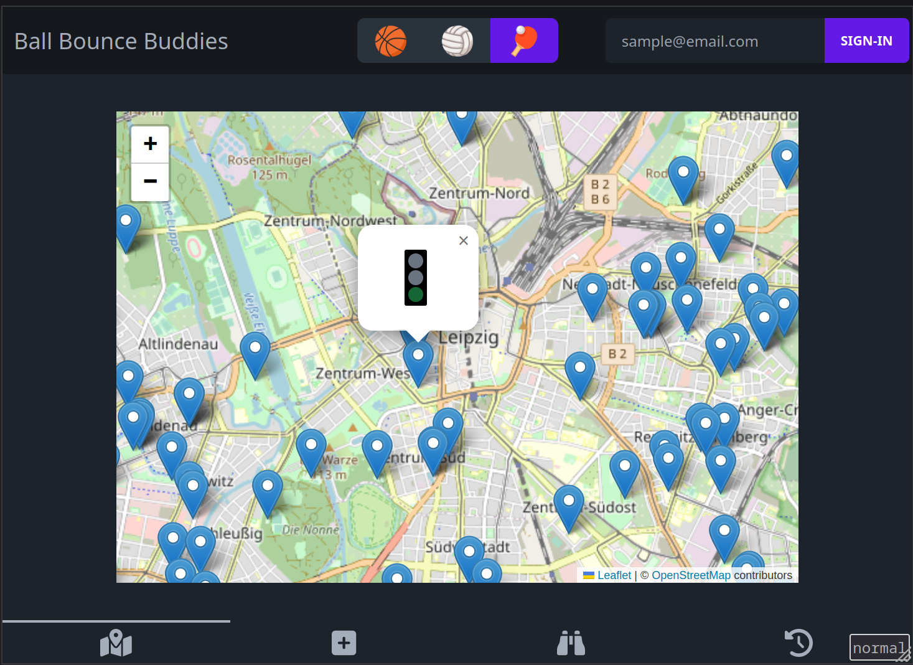

# Ball Bounce Buddies

[Ball bounce buddies](https://ball-bounce-buddies.fly.dev/) is a submission for the seminar "Computational Spatial Humanities" taking place at the university of Leipzig in the summer semester 2023. The created application centers around a map displaying sport places in Leipzig. Places are scraped from the OpenStreetMap API. Users can view the current status of a sport place, create arrangements with other users via a chat and propose new sport places.

## Contributing

- make sure yarn, node version manager and docker is installed
- clone the repo
- `yarn install`
- `yarn db:dev`
- `yarn db:seed`
- `yarn dev`
- Profit

**PRs are welcome :)**
